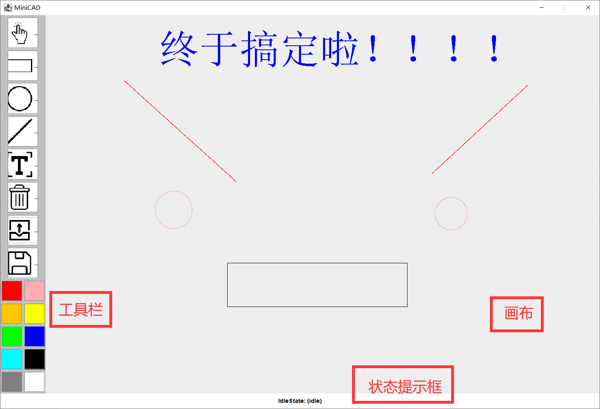
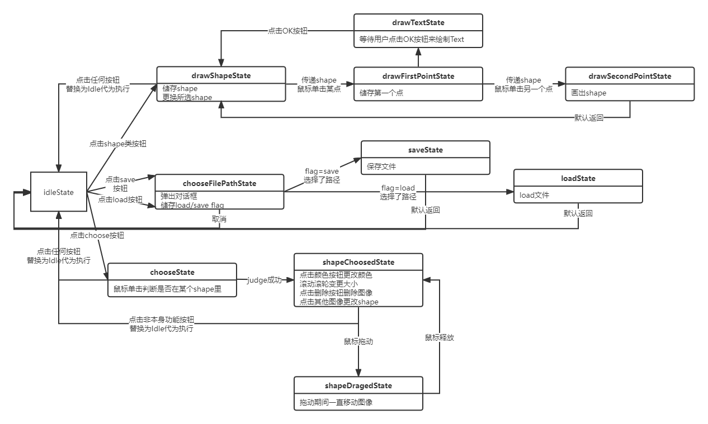
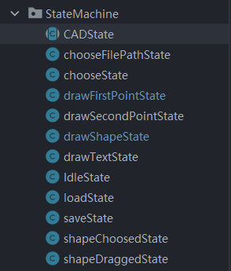

# MiniCAD 实验报告
>  MiniCAD for zju JAVA course

## 题目要求

用Java的awt和swing做一个简单的绘图工具，以CAD的方式操作，能放置直线、矩形、圆和文字，能选中图形，修改参数，如颜色等，能拖动图形和调整大小，可以保存和恢复。功能请参考视频演示。

要求上传：

1. 源码；
2. 实验报告；
3. 可执行的jar文件。

实验报告中须注明使用的Java版本、在Linux平台上编译源码及运行的命令。

## 程序运行效果示意图



## 运行方式

用console打开./jar文件夹，执行命令

```shell
java -jar MiniCAD.jar
```

## 编译方式

### PREPARE

Make sure you are in `./compile` folder.

```shell
pwd
```

### COMPILE

```shell
 javac @sourceList.txt -encoding utf-8
```

### RUN

```shell
java start
```


## 程序功能介绍

***请随时留意程序状态提示框的指引。***

- 选择图形
  - 点击图形即可选中图形
  - 在图形被选中的情况下
    - **点击颜色按钮可以调整图形颜色**
    - **可以拖动图形调整位置**
    - **可以使用鼠标滚轮调整图形大小**
    - 可以点击删除按钮删除图形
    - 点击其他图形来选择其他图形
- 矩形
  - 点击两个点来绘制矩形
- 圆形
  - 点击一个点选择圆心
  - 点击第二个点来决定半径
- 直线
  - 点击第一个点来选择直线的第一个点
  - 点击第二个点来选择直线的第二个点
- 文本
  - 点击一个点来选择文本框生成位置
  - 输入文本生成文字
- 删除
  - 选中图形的条件下，点击可以删除图形
- 载入
  - 载入*.cad文件
- 保存
  - 保存*.cad文件

## 关键实现介绍

### 状态机



项目使用了状态机来管理整个程序的运行。



我们以状态机的父类`CADState`为例：

```java
public abstract class CADState {
    protected String stateName;
    protected String notify;
    private MiniCAD miniCAD;

    CADState(MiniCAD miniCAD) {
        this.miniCAD = miniCAD;
    }

    public void setStateName(String stateName) {
        System.out.println("\nnow state: " + stateName);
        this.stateName = stateName;
    }

    public void setNotify(String notify) {
        this.notify = notify;
        miniCAD.setNotifyLable(getStateName()+": "+notify);
    }

    public abstract void handle();
    public abstract void clickButton(ActionEvent event);
    public abstract void mouseDragged(MouseEvent event);
    public abstract void mouseReleased(MouseEvent event);
    public abstract void mouseMoved(MouseEvent event);
    public abstract void mouseEntered(MouseEvent event);
    public abstract void mouseExited(MouseEvent event);
    public abstract void mouseClicked(MouseEvent event);
    public abstract void mousePressed(MouseEvent event);
    public abstract void mouseWheelMoved(MouseWheelEvent event);
    public String getNotify() {
        return notify;
    }

    public String getStateName() {
        return stateName;
    }

    protected void setNextState(CADState nextState){
        System.out.println("(state change:" + miniCAD.nowState.getStateName() + " -> " + nextState.getStateName()+")");
        //不能在此处设置nowState，因为构造函数会先于设置nowState出发，导致状态机的实际状态与nowState发生冲突
        //正确的设置方法是在状态的构造函数内，handle()之前设置nowState
    }

    public MiniCAD getMiniCAD(){
        return miniCAD;
    }

    /*
     * @description: 用于统一处理按钮的函数。写在这里是为了避免在不同状态机一直写同一大段代码
     * @param event: 按钮事件
     * @return void
     */
    protected void logButtonName(ActionEvent event){
        System.out.println("button clicked: "+event.getActionCommand());
    }
    protected void logSwitchDefault(String switchCaseName){
        System.out.println("An switch default is occurred: " + switchCaseName);
    }

}
```

一个`CADState`里面包括了这个State的名字，这个State对应的状态提示框的信息，基本的行动函数`handle()`、完整的事件监听处理函数以及一些其他行为函数。函数`handle()`将会在状态构造函数的最后调用。

可以看到我们在`CADState`中设置了各种事件的回调函数，这使得我们在`MiniCAD`类中的监听器可以直接调用现在的状态的事件处理函数。

MiniCAD中对于事件的回调处理如下：

当某一监听事件发生时，直接调用`nowState`对应的监听处理方法来处理监听事件的发生，从而达成状态机切换。

```java
public CADState nowState; //目前的状态

public MiniCAD(){
        //顺序不能随意调换，需要先初始化state和actionListener,最后才能加鼠标监听
        nowState = new IdleState(this);
        actionListenerInit();
        /*
         * 设置各种组件，略
         */
    	setMouseListener();
        mainJFrame.setVisible(true);
    }

{...略}

private void setMouseListener(){
        drawBoard.addMouseListener(new MouseListener() {
            @Override
            public void mouseClicked(MouseEvent e) {
                nowState.mouseClicked(e);
            }

            @Override
            public void mousePressed(MouseEvent e) {
                nowState.mousePressed(e);
            }

            @Override
            public void mouseReleased(MouseEvent e) {
                nowState.mouseReleased(e);
            }

            @Override
            public void mouseEntered(MouseEvent e) {
                nowState.mouseEntered(e);
            }

            @Override
            public void mouseExited(MouseEvent e) {
                nowState.mouseExited(e);
            }
        });
        drawBoard.addMouseMotionListener(new MouseMotionListener() {
            @Override
            public void mouseDragged(MouseEvent e) {
                nowState.mouseDragged(e);
            }

            @Override
            public void mouseMoved(MouseEvent e) {
                nowState.mouseMoved(e);
            }
        });
        drawBoard.addMouseWheelListener(new MouseWheelListener() {
            @Override
            public void mouseWheelMoved(MouseWheelEvent e) {
                nowState.mouseWheelMoved(e);
            }
        });
    }
    private void actionListenerInit(){
        actionListener = new ActionListener() {
            @Override
            public void actionPerformed(ActionEvent e) {
                nowState.clickButton(e);
            }
        };
    }
```

使用状态机的好处就是让整个代码结构变得更加清晰，极大地增加了代码的可读性和可维护性。

各个状态机的切换一目了然，Debug信息（打log）也十分的方便。

### Shape类

基础的图形类。

```java
public abstract class Shape implements Serializable {
    protected int x,y;
    protected Color color;

    public Shape(int x, int y, Color color) {
        this.x = x;
        this.y = y;
        this.color = color;
    }
    public void setColor(Color color){
        this.color = color;
    }
    public void moveTo(int toX,int toY){
        x = toX; y = toY;
    }
    public abstract void addSize(float dsize);
    public abstract void subSize(float dsize);
    public abstract void draw(Graphics graphics);
    public abstract boolean isIn(int nowX, int nowY);
}
```

有四个子类`Rectangular`、`Circle`、`Line`、`Text`。

其中需要实现的抽象函数有：

- addSize()  增大图形
- subSize()  减小图形
- draw()  绘制图形
- isIn()  查看某个点是否在图形内

### 绘图与重绘

用于重绘整个drawBoard。一般在图形有改变时调用

具体思路为：清除整个程序并重绘。

```java
public void paintAllShapes(Graphics2D graphics){
        graphics2D = (Graphics2D) drawBoard.getGraphics();
        graphics2D.setColor(DefaultSettings.DRAW_BOARD_BGCOLOR);
		drawBoard.getGraphics().clearRect(0,0,
			DefaultSettings.WINDOW_WIDTH,
            DefaultSettings.WINDOW_HEIGHT);
        for(Shape shape: shapes){
            shape.draw(graphics2D);
        }
    }
```

### DefaultSettings

用于储存程序内使用的各种数据，从而避免程序中直接出现硬编码，以便于程序的维护。

```java
package MiniCAD;

import java.awt.*;

public class DefaultSettings {

    //region UI default settings
    public static final int WINDOW_WIDTH = 1200;//窗口宽度
    public static final int WINDOW_HEIGHT = 815;//窗口高度
    public static final int TOOLBAR_WIDTH = 90;//工具栏宽度
    public static final int BOTTOMBAR_WIDTH = WINDOW_WIDTH - TOOLBAR_WIDTH;//底部栏宽度
    public static final int BOTTOMBAR_HEIGHT = 30;//底部栏高度
    public static final int TOOLBAR_HEIGHT = WINDOW_HEIGHT - BOTTOMBAR_HEIGHT;//工具栏高度
    public static final int TOOL_ICON_SIDE_LENGTH = 50;//工具图标边长
    public static final int COLOR_SIDE_LENGTH = 40;//颜色选择器边长
    public static final Color TOOLBAR_BGCOLOR = Color.lightGray;//ToolBar的背景颜色
    public static final Color TOOLBUTTON_BGCOLOR = Color.white;//ToolButton的背景颜色
    public static final Color BOTTOMBAR_BGCOLOR = Color.white;//BottomBar的背景颜色
    public static final Color NOTIFY_COLOR = Color.black;//Notify文字的颜色
    public static final Color DRAW_BOARD_BGCOLOR = Color.white;//drawBoard的背景颜色
    public static final String TEXT_LABLE_CONTENT = "Input Text(No longer than 100)";//输入text的弹出框的label的文字
    public static final String TEXT_FRAME_NAME = "Text";//输入text的弹出框的框名
    public static final int TEXT_WIDTH = 400;//输入text的弹出框的框宽度
    public static final int TEXT_HEIGHT = 150;//输入text的弹出框的框高度
    public static final int TEXT_COLOMN = 32;//输入text的弹出框的文字列数
    //endregion

    //region shape default settings
    public static final float SHAPE_DEFAULT_DELTA_SIZE = 5.0f;//shape的默认增大增小量度
    public static final int TEXT_DEFAULT_SIZE = 20;
    public static final float SHAPE_MIN_SIZE = 10.0f;//shape的最小大小
    public static final float LINE_NEAR_RANGE = 3.0f;//用于判断某个点是否在Line的旁边，基本用于Line的isIn
    public static final int FONT_SIZE_BASE = 1;//font-size的基数
    public static final Color DEFAULT_SHAPE_COLOR = Color.black;//默认shape颜色
    //endregion
}

```


